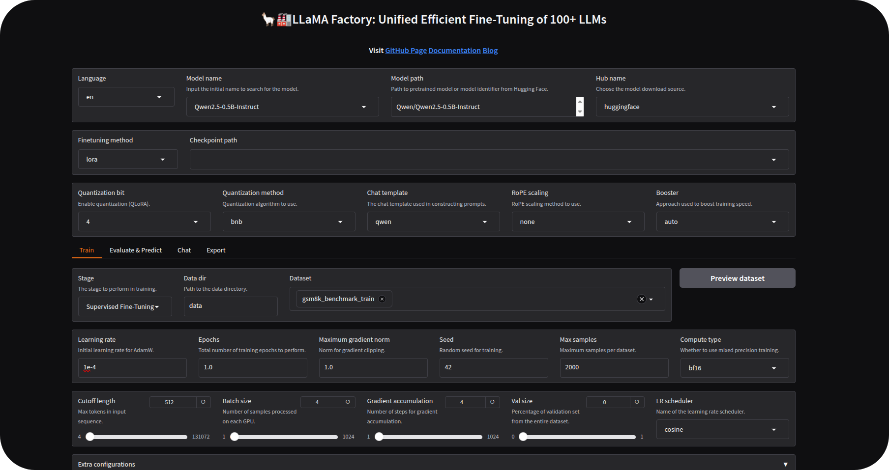
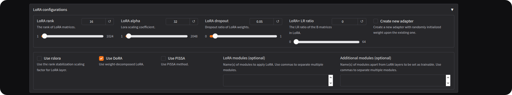
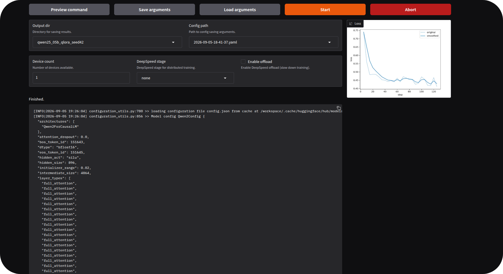
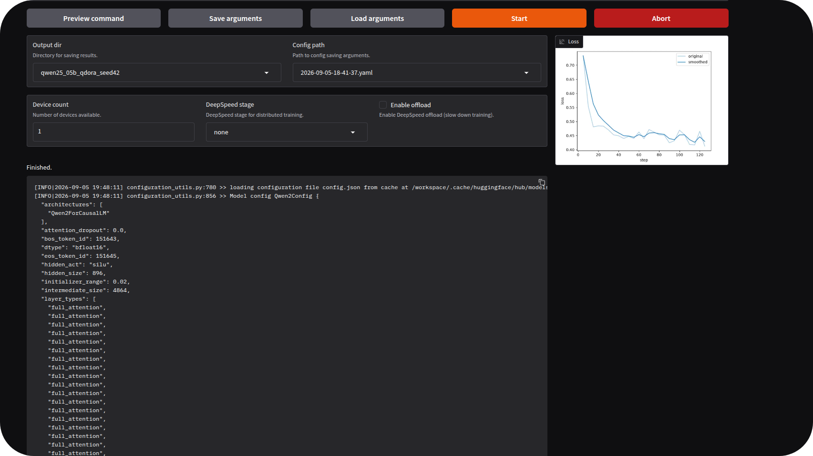
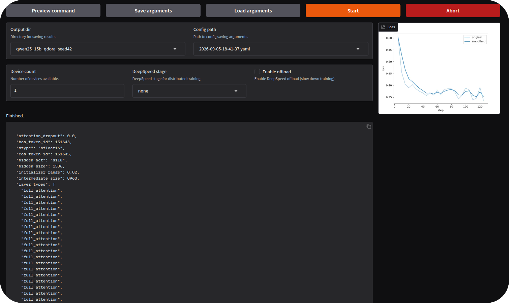
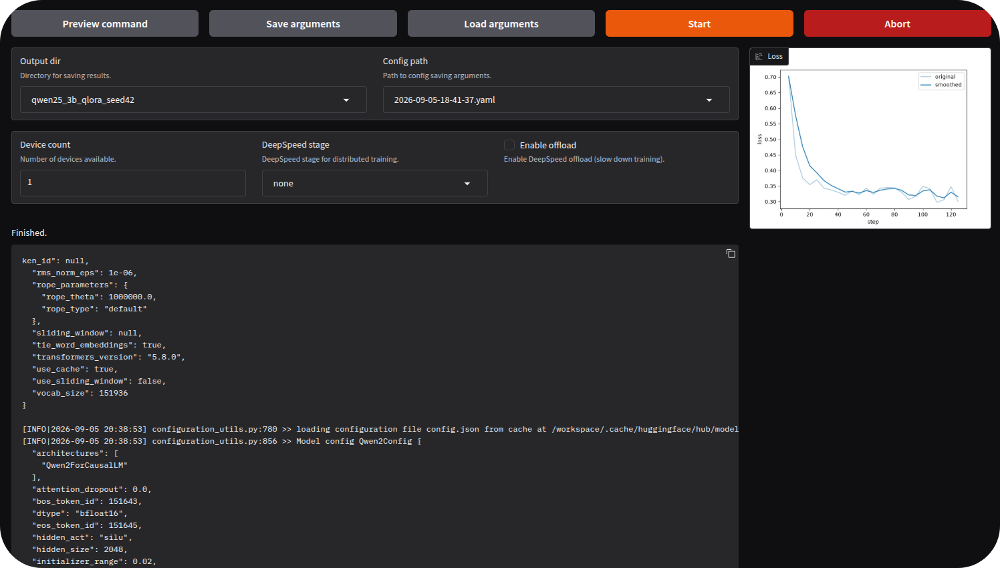
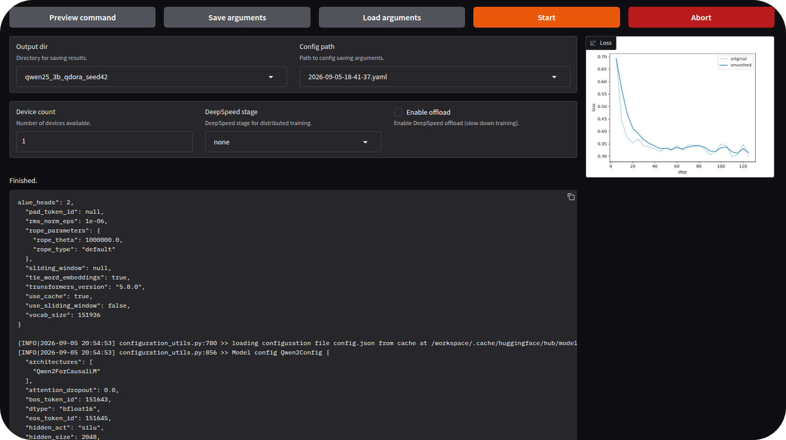

I trained Qwen2.5 of 0.5B, 1.5B, 3B and 7B with QLoRA and QDoRA, keeping the same recipe within each pair. The question: if the model is already going to be trained in 4 bits with LoRA, is it worth activating DoRA?\
There were eight official training runs. Then, I evaluated Baseline, QLoRA and QDoRA at the four scales, always with the same 100 GSM8K problems. This resulted in 12 conditions and 1.200 generations.\
The result changed as the model grew. At 0.5B and 1.5B, QLoRA finished 2 percentage points ahead. At 3B and 7B, QDoRA moved ahead and opened a 5-point lead. At the same time, training with QDoRA became increasingly time-consuming.\
This combination is what matters most in the comparison. A winner for all scales did not appear. The choice changed along with the model size.

## What QLoRA and QDoRA change

QLoRA keeps the base model quantized in 4 bits and trains LoRA adapters. The idea is to reduce memory usage without having to update all the model weights.\
DoRA changes the way the weight update is handled. Instead of working with the weight as a single quantity, DoRA separates magnitude and direction. The low-rank update acts on the direction, while the magnitude is handled separately.\
QDoRA combines these two ideas. The base model remains quantized, but the adapters use DoRA. For this benchmark, this made it possible to keep the pairs practically identical and isolate the variable I wanted to measure.\
At each scale, QLoRA and QDoRA used the same model, the same revision, the same dataset, the same seed and the same hyperparameters. The only intentional difference was:

- `QLoRA: use_dora=false`
- `QDoRA: use_dora=true`\
  The four pairs passed the configuration comparison with this difference isolated.

## Environment

The entire benchmark was run on an NVIDIA RTX A6000 with 48 GB, Ampere architecture, on Runpod. The interface used to configure the training runs was the LLaMA-Factory WebUI.\
The stack recorded in the experiment was:

- GPU: NVIDIA RTX A6000 48 GB
- PyTorch: 2.8.0+cu128
- CUDA runtime: 12.8
- Transformers: 5.8.0
- PEFT: 0.18.1
- Datasets: 4.0.0
- Accelerate: 1.11.0
- bitsandbytes: 0.50.2
- LLaMA-Factory: commit `dced5f8804bfbf7109ef7c14401db6bd5cce7e53`\
  Using the WebUI also helped to check the pairs before each run and to keep the screenshots organized by stage.

## Training recipe

The same recipe was applied to the four scales, with QLoRA and QDoRA sharing all the parameters of the pair.

- Family: Qwen2.5-Instruct
- Scales: 0.5B, 1.5B, 3B and 7B
- Dataset: GSM8K
- Training examples: 2.000
- Epochs: 1
- Seed: 42
- Fine-tuning: LoRA
- Quantization: bitsandbytes 4-bit / NF4
- Double quantization: enabled
- Compute: BF16
- LoRA rank: 16
- LoRA alpha: 32
- LoRA dropout: 0.05
- Target modules: all supported linear ones
- Learning rate: 1e-4
- Scheduler: cosine
- Warmup ratio: 0.05
- Cutoff: 512
- Micro-batch: 4
- Gradient accumulation: 4
- Effective batch: 16
- Gradient checkpointing: enabled\

\
The image above shows the configuration of the 0.5B QLoRA, with the model, the dataset, the quantization, the batch, the cutoff and the other parameters of the pair.\
In QDoRA, the configuration remained the same. The change was the activation of DoRA.

\
The same logic was maintained across the four sizes.

## How the evaluation was done

The main metric was numeric exact match on GSM8K. The frozen pool had 500 problems, and the set used in the benchmark was defined by the indices `0..99`.\
The 12 conditions received exactly the same 100 problems. Since there are four scales and three conditions per scale, the total came to 1.200 generations.\
The generation protocol also remained fixed:

- `do_sample = false`
- `num_beams = 1`
- `max_new_tokens = 512`
- `repetition_penalty = 1.0`
- `seed = 42`\
  The parser and the scoring rule were the same in all conditions. In addition to exact match, I recorded format compliance, parse failures, truncations and evaluation runtime.\
  With 100 examples per condition, each correct answer corresponds to 1 percentage point. This makes the results easier to read, but it also calls for caution when the difference is small.

## Overall result

The quality results were:

- 0.5B: Baseline 35/100, QLoRA 32/100, QDoRA 30/100. QDoRA was 2 points below QLoRA.
- 1.5B: Baseline 75/100, QLoRA 53/100, QDoRA 51/100. QDoRA was 2 points below QLoRA.
- 3B: Baseline 87/100, QLoRA 61/100, QDoRA 66/100. QDoRA was 5 points above QLoRA.
- 7B: Baseline 92/100, QLoRA 74/100, QDoRA 79/100. QDoRA was 5 points above QLoRA.\
  The change appears between 1.5B and 3B. In the two smaller ones, QLoRA was ahead by 2 points. In the two larger ones, QDoRA was ahead by 5.\
  I do not treat 3B as a magic number, nor these four results as a rule for any family. What happened in this benchmark was a clear change of sign starting at 3B, repeated again at 7B.

## 0.5B: QLoRA was the better choice

On Qwen2.5-0.5B, QLoRA finished with 32 correct answers out of 100, while QDoRA ended with 30. The quality difference was small, but the runtime separated the two methods considerably.\
The main numbers of the pair were:

- QLoRA: train loss 0,4678, runtime of 157,1 seconds, adapter of 33,60 MiB.
- QDoRA: train loss 0,4667, runtime of 259,1 seconds, adapter of 34,79 MiB.
- QDoRA training overhead: approximately 65%.\
  The training loss ended slightly lower with QDoRA, but this did not turn into an advantage on GSM8K. It is a good example of why I would not use training loss alone to choose the method.\

\
0.5B QLoRA at the end of training.

\
0.5B QDoRA at the end of training.\
In the evaluation, QLoRA had 94% format compliance and 6% truncation. QDoRA had 95% format compliance and 5% truncation. There was no parse failure in either condition.\
For 0.5B, I would choose QLoRA. It finished ahead and took much less time to train.

## 1.5B: the same quality difference, with more training time

On Qwen2.5-1.5B, the quality difference repeated itself. QLoRA scored 53% and QDoRA scored 51%, again with 2 points between the two.\
The runtime difference, however, increased considerably:

- QLoRA: train loss 0,3854, runtime of 257,2 seconds, peak of 14.992 MiB of VRAM, adapter of 70,49 MiB.
- QDoRA: train loss 0,3847, runtime of 544,7 seconds, peak of 15.412 MiB of VRAM, adapter of 72,97 MiB.
- QDoRA training overhead: approximately 112%.
- Peak VRAM difference: 420 MiB, around 2,8%.\
  The adapter grew little, but the training time more than doubled. Just like at 0.5B, QDoRA finished with slightly lower loss and still ended behind in exact match.\

\
1.5B QLoRA completed.

\
1.5B QDoRA completed.\
After the first two pairs, the decision was simple. At those scales, paying more time for QDoRA did not bring a return on the main metric.

## 3B: QDoRA moves ahead

At 3B, the result changed. QLoRA got 61 of the 100 problems correct, while QDoRA got 66 correct.\
There were 5 more answers with the same base, the same seed and the same recipe. It was the first scale at which the additional cost of QDoRA came accompanied by a clear advantage in the evaluation.

3B QLoRA finished.

3B QDoRA finished.\
The training numbers were:

- QLoRA: train loss 0,3535, runtime of 428,7 seconds, peak of 16.545 MiB of VRAM, adapter of 114,25 MiB.
- QDoRA: train loss 0,3521, runtime of 967,0 seconds, peak of 17.099 MiB of VRAM, adapter of 118,22 MiB.
- QDoRA training overhead: approximately 126%.
- Peak VRAM difference: 554 MiB, a little more than 3%.\
  The cost appeared mainly in time. The adapter remained close in size, and the VRAM difference was small compared with the increase in runtime.\
  In this pair, the trade-off became clear: QDoRA took more than twice the time and finished 5 points ahead.

## 7B: the advantage repeats itself

At 7B, QDoRA maintained the 5-point difference. QLoRA scored 74%, while QDoRA reached 79%.\
Repeating the same delta at the next scale makes the 3B result more relevant. It does not prove that DoRA always improves from this size onward, but it shows that the shift was not restricted to a single checkpoint.

7B QLoRA completed.

\
7B QDoRA completed.\
The numbers of the pair were:

- QLoRA: train loss 0,2459, runtime of 656,4 seconds, peak of 20.013 MiB of VRAM, adapter of 154,05 MiB.
- QDoRA: train loss 0,2440, runtime of 1.720,6 seconds, peak of 18.309 MiB of VRAM, adapter of 159,38 MiB.
- QDoRA training overhead: approximately 162%.\
  QLoRA took just under 11 minutes. QDoRA took around 28 minutes and 41 seconds.\
  The peak VRAM measured on QDoRA was lower than on QLoRA. I would not use this value to claim that QDoRA consumes less memory in general, because it is only the peak observed in these two runs.\
  In the evaluation, Baseline, QLoRA and QDoRA finished the 100 examples without truncation. The two adapted versions ended with 99% format compliance and zero parse failures.

## The turning point

The QDoRA minus QLoRA delta summarizes the behavior well:

- 0.5B: -2 pp
- 1.5B: -2 pp
- 3B: +5 pp
- 7B: +5 pp\
  In this family and with this recipe, QDoRA began to have an advantage at 3B and maintained the advantage at 7B.\
  This changes the practical choice. In the two smaller models, QLoRA delivered more quality in less time. In the two larger ones, QDoRA delivered more quality, but charged considerably in runtime.

## The cost of QDoRA appeared mainly in time

Adding up the eight training runs, there were 4.990,9 seconds, or 83,18 minutes. The four QLoRA together came to approximately 25 minutes, while the four QDoRA came to approximately 58,2 minutes.\
The QDoRA overhead grew with scale:

- 0.5B: QLoRA 157,1 s, QDoRA 259,1 s, overhead of 65,0%.
- 1.5B: QLoRA 257,2 s, QDoRA 544,7 s, overhead of 111,8%.
- 3B: QLoRA 428,7 s, QDoRA 967,0 s, overhead of 125,6%.
- 7B: QLoRA 656,4 s, QDoRA 1.720,6 s, overhead of 162,1%.\
  The QDoRA adapters were around 3,5% larger than the QLoRA ones at all scales. In the pairs where the peak VRAM is directly comparable, the memory difference was also far below the runtime difference.\
  In this setup, the cost of QDoRA appeared mainly in training time.

## And the base model?

The Baseline was ahead of both adapted versions at all four scales:

- 0.5B: Baseline 35%, QLoRA 32%, QDoRA 30%.
- 1.5B: Baseline 75%, QLoRA 53%, QDoRA 51%.
- 3B: Baseline 87%, QLoRA 61%, QDoRA 66%.
- 7B: Baseline 92%, QLoRA 74%, QDoRA 79%.\
  This means that one epoch on 2.000 examples, with this recipe, did not improve the exact match of the original model. The benchmark measures something else: how QLoRA and QDoRA behave when they receive exactly the same adaptation.\
  At 3B, QLoRA was 26 points below the Baseline and QDoRA was 21 below. At 7B, QLoRA was 18 points below and QDoRA was 13 below.\
  If the only goal were the highest exact match in this configuration, I would keep the base model. If the choice were between the two adaptation methods, the decision would change according to scale.

## Training loss does not choose the winner

QDoRA finished with slightly lower training loss in all four pairs:

- 0.5B: QLoRA 0,4678, QDoRA 0,4667.
- 1.5B: QLoRA 0,3854, QDoRA 0,3847.
- 3B: QLoRA 0,3535, QDoRA 0,3521.
- 7B: QLoRA 0,2459, QDoRA 0,2440.\
  The loss pattern is consistent, but it does not resolve the comparison. In the two smaller models, QDoRA had lower loss and worse exact match. In the two larger ones, it had lower loss and better exact match.\
  For this reason, I would use the loss curve to track training, not to decide which method won. The decision needs to come from the task being measured.

## What I would choose

For 0.5B and 1.5B, I would use QLoRA. In both cases, it finished 2 points ahead and trained much faster.\
For 3B and 7B, I would consider QDoRA when 5 extra points of exact match justified the additional time. In these two models, the gain appeared equally, but the runtime also increased considerably.\
There is no single answer for all four scales. In this benchmark, QLoRA made more sense in the smaller models, while QDoRA started to be worth it in the larger ones when the priority was the task metric.

## Limitations

The benchmark uses a single seed, 42, and the main evaluation has 100 examples per condition. This means that a single correct answer changes the result by 1 percentage point, so small differences need to be read carefully.\
I also used a single model family, a single dataset, one rank, one learning rate and one GPU. These choices help keep the comparison controlled, but limit how far the conclusion can be taken.\
The result I would most like to test next is the change of sign between the smaller and larger models. If it appears again in other families and tasks, we will have a better basis for understanding when the cost of DoRA begins to pay off.

## Reproducibility

The benchmark was preserved with the exact model revisions, dataset hashes, configurations, predictions in JSONL, evaluation summaries, runtime metrics, VRAM measurements, logs and scripts used in the analysis.\
The eight adapters were also published as assets of a GitHub Release.

- Repository: `https://github.com/AntonioVFranco/qlora-vs-qdora-slm-benchmark`
- Adapter release: `https://github.com/AntonioVFranco/qlora-vs-qdora-slm-benchmark/releases/tag/benchmark-artifacts-v1`\
  The final package contains the eight training runs, the 12 quality conditions, the consolidated matrix, the hashes and the files used to arrive at the numbers in this article.

## Conclusion

The initial question was whether it was worth activating DoRA in a training run that already used QLoRA. In this benchmark, the answer changed according to model size.\
On Qwen2.5-0.5B and Qwen2.5-1.5B, QLoRA was better in exact match and finished much faster. On Qwen2.5-3B and Qwen2.5-7B, QDoRA moved 5 points ahead, but the training cost grew along with it.\
The QDoRA overhead started at 65% at 0.5B and reached 162% at 7B. For this reason, I would not treat DoRA as an option that should be activated by default.\
With this recipe and in this family, I would use QLoRA below 3B. Starting at 3B, I would consider QDoRA when the 5 extra points of exact match were worth the additional training time.
